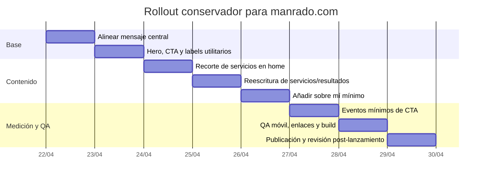

# Recomendaciones sutiles para afinar manrado.com

## Archivos inspeccionados en GitHub

Inspeccioné estos archivos del repositorio `manrado/Clientes` para identificar copy reutilizable, estructura actual, activos y posibles materiales de prueba o portafolio. En lo inspeccionado sí hay base de copy y estructura; no encontré casos redactados, capturas de entregables ni activos visuales de cliente listos para publicar. Lo más reutilizable hoy es el README, la home, la página de servicios, la página de resultados y el esqueleto del área de reportes. fileciteturn7file0L1-L1 fileciteturn13file0L1-L1 fileciteturn14file0L1-L1 fileciteturn15file0L1-L1 fileciteturn18file0L1-L1

| Archivo | Qué aporta | Reutilización recomendada |
|---|---|---|
| `README.md` | Resume el posicionamiento actual: integración CFDI–bancos–contabilidad, procesos eficientes y soporte a auditoría. fileciteturn7file0L1-L1 | Base para reescribir hero, metadescripción y extracto de LinkedIn. |
| `index.html` | Define el hero, menú, CTA por correo, enlace a “Reportes”, cuatro cards de servicios y footer. También confirma el uso de una imagen stock de Unsplash en la portada. fileciteturn13file0L1-L1 | Principal archivo para cambios sutiles de posicionamiento, CTA y jerarquía de home. |
| `servicios.html` | Lista servicios fiscales, contables, nómina, RH y procesos especiales; hoy empuja el sitio hacia un perfil más generalista. fileciteturn14file0L1-L1 | Reordenar para que lo principal sea cierre contable-fiscal y lo demás quede como complementario. |
| `resultados.html` | Muestra tres resultados abstractos: agilidad, precisión y claridad. fileciteturn15file0L1-L1 | Reescribir con resultados más observables y menos genéricos. |
| `assets/styles.css` | Confirma que el sitio es estático, sencillo de editar y con estilos ya preparados para hero, cards, CTA flotante y footer. fileciteturn20file0L1-L1 | Cambios de copy/estructura de bajo riesgo y bajo esfuerzo. |
| `assets/scripts.js` | No muestra instrumentación analítica visible; sólo registra service worker, menú móvil, accesibilidad del FAB y año del footer. fileciteturn23file0L1-L1 | Antes de probar CTA, conviene añadir eventos mínimos. |
| `package.json` | El build es liviano: PostCSS, Terser, `http-server` y un script de validación. fileciteturn21file0L1-L1 | Favorece un rollout rápido sin rehacer stack ni CMS. |
| `reportes/index.html` y `reportes/panel.html` | Existe un acceso privado básico a reportes, pero es sólo ocultamiento del lado cliente; el propio archivo sugiere usar una solución real si se quiere proteger contenido sensible. Además, el panel sólo lista archivos placeholder (`reporte1.pdf`, `reporte2.csv`). fileciteturn17file0L1-L1 fileciteturn18file0L1-L1 | Útil como base para un área privada de ejemplos sanitizados, no como portafolio público tal como está hoy. |
| `dev/PR_REFRACTOR_SVG_MODULES.md` | Documenta sprite SVG compartido, modularización y checklist manual de validación. fileciteturn25file0L1-L1 | Útil para QA y para mantener cambios pequeños sin romper la UI. |

## Resumen ejecutivo

La oportunidad principal no está en “rediseñar” manrado.com, sino en **hacer más nítida la propuesta ya existente**. Hoy la frase más poderosa del sitio es la idea de **integración CFDI–bancos–contabilidad**; esa parte sí es específica y diferenciadora. El problema es que el sitio arranca con una promesa buena, pero después se abre demasiado pronto a SAT, IMSS, nómina, padrón de importadores y licitaciones, lo que hace que la percepción se desplace de “solución especializada para el cierre contable-fiscal” a “despacho generalista”. Ese patrón se ve tanto en el README y los HTML inspeccionados como en la home pública indexada. fileciteturn7file0L1-L1 fileciteturn13file0L1-L1 fileciteturn14file0L1-L1 citeturn0view0turn2search1

También hay una segunda oportunidad muy clara: **la home actual comunica “qué haces”, pero no aterriza con suficiente precisión “para quién” y “qué paso sigue”**. La CTA central hoy es correo o una frase genérica, y el H1 “Análisis de Información Financiera” se queda corto frente al valor real que quieres enfatizar. Google además usa señales como el `<title>`, el H1 visible y `og:title` para formar los enlaces de título, y puede usar el contenido de la página o la metadescripción para el snippet; por eso conviene alinear la home con un mensaje más concreto y consistente. fileciteturn13file0L1-L1 citeturn2search7turn5search0

La recomendación práctica y conservadora es esta: **mantener el diseño y la navegación casi intactos**, pero hacer ocho ajustes de copy y jerarquía. Esos cambios son de bajo riesgo porque el sitio es un stack estático simple, con archivos planos y build liviano. No hace falta crear secciones nuevas grandes ni promesas más agresivas; basta con **sustituir frases genéricas por frases orientadas al cierre contable-fiscal**, hacer la CTA más accionable, reducir a tres elementos lo visible en la home y dejar los servicios secundarios en una capa más profunda. fileciteturn20file0L1-L1 fileciteturn21file0L1-L1

La limitación principal de la auditoría es una discrepancia entre el repo y la versión pública: en el repo, `servicios.html` y `resultados.html` son páginas separadas; en la home pública indexada, el crawler ya ve bloques equivalentes de “Detalle de Servicios” y “Resultados” dentro de la misma URL. Asumí el repo como fuente de implementación, pero conviene verificar el build o deploy antes de editar copy para no corregir archivos que luego no son los que realmente publica la home. fileciteturn14file0L1-L1 fileciteturn15file0L1-L1 citeturn0view0

## Auditoría del sitio actual

La home pública muestra hoy una estructura clara pero muy expandida: marca, menú con “Servicios” y “Resultados”, hero con imagen y enlace a “Reportes”, un H1 genérico, una frase de valor más específica, un bloque de servicios, un detalle amplio de servicios y un bloque de resultados, además de una CTA y footer. El repo confirma la misma lógica general, aunque distribuida en páginas separadas. No observé un bloque visible de “Sobre mí” o un ancla personal equivalente dentro de la home. fileciteturn13file0L1-L1 fileciteturn14file0L1-L1 fileciteturn15file0L1-L1 citeturn0view0

Lo mejor del sitio actual es que **ya contiene el material correcto para afinar el enfoque sin inventar nada**: la frase “Integración CFDI–bancos–contabilidad”, los conceptos “Integridad de Datos” y “Soporte a Auditoría”, y el cierre “Cuéntanos tu situación y te proponemos un plan claro y accionable” son rescatables porque son concretos, prudentes y compatibles con una consultoría especializada. En cambio, “Análisis de Información Financiera” es demasiado amplio como H1 y como `<title>`, y la cascada completa de servicios secundarios hace que el mensaje pierda foco. fileciteturn7file0L1-L1 fileciteturn13file0L1-L1 citeturn0view0turn2search1

El sitio también tiene un problema de **etiquetas y expectativas**. En navegación, textos claros y específicos mejoran la comprensión; NN/g recomienda labels visibles, específicos, breves y consistentes, evitando jerga o nombres ambiguos. Bajo ese criterio, “Reportes” funciona si el usuario ya sabe que es un área privada, pero no es el label más claro para primera visita comercial. “Acceso a reportes” o moverlo a una utilidad secundaria sería más explícito y de menor fricción. fileciteturn13file0L1-L1 citeturn6search2turn7search3

Otro detalle sutil: la portada usa una imagen genérica de dashboards servida desde Unsplash. Eso no “rompe” el sitio, pero sí deja dinero sobre la mesa. NN/g recomienda que las imágenes en móvil agreguen valor informativo y no sólo decoren, porque alargan la página y pueden empeorar la percepción de rendimiento. En este caso, un visual real y sanitizado de un entregable, checklist o dashboard propio sería más fuerte; si aún no lo tienes listo para publicar, la alternativa conservadora es mantener la imagen actual en desktop y simplificarla o restarle peso en móvil. fileciteturn13file0L1-L1 citeturn6search0

### Texto, headings y menú que conviene conservar

La siguiente tabla reúne los elementos actuales que sí conviene mantener, sea literal o casi literal, porque ya aportan claridad o confianza.

| Elemento actual | Mantener | Motivo |
|---|---|---|
| `Manrado` | Sí | La marca es sobria y ya funciona como firma visible. fileciteturn13file0L1-L1 |
| `Servicios` | Sí | Label claro y estándar para navegación principal. fileciteturn13file0L1-L1 |
| `Resultados` | Sí, por ahora | Label breve y comprensible; más adelante podría evolucionar a “Ejemplo” cuando exista un caso real público. fileciteturn13file0L1-L1 |
| `Integración CFDI–bancos–contabilidad` | Sí, literal | Es el fragmento más diferenciador del posicionamiento actual. fileciteturn7file0L1-L1 fileciteturn13file0L1-L1 |
| `Integridad de Datos` | Sí, como concepto | Vale mantener la idea, aunque sugiero volverla más operativa en la home. fileciteturn13file0L1-L1 |
| `Soporte a Auditoría` | Sí, como promesa prudente | Aporta credibilidad y no sobrepromete. fileciteturn7file0L1-L1 |
| `Cuéntanos tu situación y te proponemos un plan claro y accionable.` | Sí, con mínima edición | Buen tono consultivo; sólo necesita un CTA más específico debajo. fileciteturn7file0L1-L1 citeturn0view0 |
| `Contenido alineado con SAT y prácticas contables mexicanas.` | Sí | Buen cue de contexto regulatorio mexicano. fileciteturn13file0L1-L1 |

## Cambios sutiles propuestos

Estas propuestas son deliberadamente conservadoras: no cambian el estilo general del sitio ni exigen un rediseño, pero sí reordenan la lectura para que la especialidad se entienda mejor. La lógica se apoya en la evidencia del sitio actual, en el repo y en buenas prácticas de títulos, labels claros, CTA y jerarquía de home. Google recomienda alinear título visible, H1 y metadescripciones útiles; NN/g recomienda labels claros y mover lo secundario a un plano visual más secundario; HubSpot recomienda CTA claros y pruebas A/B cambiando solo una variable. citeturn2search7turn5search0turn6search2turn4search4turn3search1turn3search3

| Cambio | Rationale | Texto exacto propuesto | Ubicación sugerida | Esfuerzo |
|---|---|---|---|---|
| Alinear `<title>`, H1 y metadescripción con el posicionamiento nuevo | Hoy `title`, `og:title` y H1 son demasiado genéricos; Google usa justamente esas señales para representar la página. fileciteturn13file0L1-L1 citeturn2search7turn5search0 | **`<title>`**: `Manrado | Automatización del cierre contable-fiscal` **H1**: `Automatización del cierre contable-fiscal` **Meta description / og:description**: `Integramos CFDI, bancos y contabilidad para ordenar el cierre mensual, reducir retrabajo y dejar la información lista para revisión.` | `index.html` → `<title>`, `meta[name="description"]`, `meta[property="og:title"]`, `meta[property="og:description"]`, `.hero .h1` | Bajo |
| Sustituir el lead del hero por una frase más concreta y menos abstracta | La frase actual ya tiene una buena base, pero aún se lee como fórmula; conviene pasarla a beneficio claro, sin sobreprometer velocidad garantizada. fileciteturn13file0L1-L1 citeturn0view0turn4search4 | **Lead**: `Integramos CFDI, bancos y contabilidad para ordenar el cierre mensual, reducir retrabajo y dejar la información lista para revisión.` **Texto de apoyo**: `Cuéntame cómo cierras hoy y te propongo el primer ajuste útil.` | `index.html` → `.hero .lead` y `.hero-sub-cta` | Bajo |
| Añadir un CTA primario visible arriba del fold y dar nombre más accionable al CTA flotante | Hoy en repo no hay un botón primario visible en hero; hay un `mailto` en menú móvil y un FAB genérico. CTA más claros y medibles suelen convertir mejor. fileciteturn13file0L1-L1 citeturn3search3turn2search6 | **Botón hero**: `Solicitar diagnóstico inicial` **CTA flotante**: `Revisar mi proceso de cierre` **Botón menú móvil**: `Solicitar diagnóstico inicial` | `index.html` → bloque hero, `.fab-contact`, `.nav-links .btn` | Bajo a medio |
| Volver “Reportes” un elemento utilitario, no protagonista comercial | “Reportes” es ambiguo para primera visita. Labels claros y específicos reducen ruido y mantienen la intención principal de la home. fileciteturn13file0L1-L1 citeturn6search2turn7search3 | **Nuevo label**: `Acceso a reportes` **Tooltip o helper opcional**: `Área privada para reportes` | `index.html` → `.hero-login a`; si quieres ir un paso más allá, replicarlo en footer y bajarle prominencia visual en hero | Bajo |
| Reducir a tres cards lo visible en home y volverlas más operativas | La home actual muestra cuatro conceptos; uno de ellos (“Procesos eficientes”) funciona mejor como beneficio, no como “servicio”. Menos opciones, más específicas, mejora escaneabilidad. fileciteturn13file0L1-L1 citeturn4search4turn6search2 | **H2**: `Qué resolvemos en tu cierre contable-fiscal` **Card 1**: `Cierre contable mensual` / `Orden de la información para llegar al cierre con menos retrabajo.` **Card 2**: `Integración y validación de datos` / `Cruce de CFDI, bancos y contabilidad para detectar diferencias y dar trazabilidad.` **Card 3**: `Información lista para revisión` / `Papeles y reportes preparados para contador interno, dirección o auditor.` | `index.html` → `#servicios` | Medio |
| Mover el resto de los servicios a una capa secundaria y reencuadrar `servicios.html` | El detalle actual expande demasiado pronto la oferta hacia nómina, IMSS y trámites. Lo principal debe aparecer primero; lo complementario después. fileciteturn14file0L1-L1 citeturn4search4turn6search2 | **Subtítulo de servicios**: `Servicios principales para ordenar e integrar tu cierre contable-fiscal. También apoyamos procesos complementarios de nómina y cumplimiento.` **Enlace desde home**: `Ver servicios complementarios` | `servicios.html` → lead y categorías; `index.html` → enlace debajo de cards o texto auxiliar | Medio |
| Hacer la sección “Resultados” menos abstracta y más observable | “Agilidad, precisión, claridad” suena bien, pero queda en branding. Conviene traducirlo a resultados que un visitante pueda imaginar en su operación. fileciteturn15file0L1-L1 citeturn0view0 | **Card 1**: `Menos retrabajo` / `Menor recaptura y revisión manual entre fuentes.` **Card 2**: `Más orden` / `Información concentrada y preparada para el cierre.` **Card 3**: `Mejor revisión` / `Papeles y reportes más claros para revisar y decidir.` **Nota opcional**: `Los alcances específicos dependen del punto de partida de cada empresa.` | `resultados.html` → `#resultados` o bloque equivalente si tu deploy actual lo incrusta en la home | Bajo |
| Añadir un “Sobre mí” mínimo, integrado al cierre de la home | Falta un ancla humana. No hace falta una nueva página; basta un párrafo breve que explique quién está detrás y por qué eso importa. | **Párrafo sugerido**: ver propuesta en la sección siguiente | `index.html` → justo arriba del footer o debajo del CTA final, como bloque de texto breve | Bajo |

## Variantes de hero y pruebas de CTA

### Comparativo de hero variants

Las siguientes tres versiones buscan claridad y bajo riesgo; ninguna promete resultados inflados ni usa cifras inventadas. Todas parten del mismo núcleo ya presente en el sitio y en el README: integración de fuentes, orden del cierre y soporte a revisión. fileciteturn7file0L1-L1 fileciteturn13file0L1-L1

| Variante | Cuándo usarla | Headline | Subheadline | Bullets | CTA |
|---|---|---|---|---|---|
| Clara y directa | La mejor opción por defecto | `Automatización del cierre contable-fiscal` | `Integramos CFDI, bancos y contabilidad para ordenar el cierre mensual y dejar la información lista para revisión.` | `Integración de fuentes clave` `Validación de diferencias` `Información preparada para revisión` | `Solicitar diagnóstico inicial` |
| Más sobria | Si quieres reducir el tono “tecnológico” | `Orden en tu cierre contable-fiscal` | `Te ayudo a concentrar y revisar la información que suele quedar dispersa entre CFDI, bancos y contabilidad.` | `Menos retrabajo manual` `Más trazabilidad` `Mejor base para revisar` | `Cuéntame tu cierre actual` |
| Más orientada al dolor operativo | Si quieres hablar a despachos o equipos saturados | `Menos retrabajo en cierres mensuales` | `Un enfoque práctico para integrar información contable y fiscal antes de revisión, dirección o auditoría.` | `CFDI, bancos y contabilidad` `Papeles y reportes más claros` `Cambios por etapas, sin exagerar promesas` | `Revisar mi proceso de cierre` |

Mi recomendación concreta es arrancar con la **variante Clara y directa**. Es la más alineada con el objetivo de “automatización del cierre contable-fiscal”, suena especializada sin parecer grandilocuente y deja espacio para que el visitante entienda rápido qué haces y qué paso sigue. Esa decisión también ayuda a que título, H1 y snippet converjan en una misma idea, algo que favorece claridad para usuarios y buscadores. citeturn2search7turn5search0

### Microcopy de CTA y sugerencias de A/B test

Estas tres microcopias son suficientemente distintas para probar intención, pero no tan agresivas como para sonar ajenas al tono actual del sitio.

| Microcopy CTA | Uso recomendado | Métrica primaria |
|---|---|---|
| `Solicitar diagnóstico inicial` | Más consultivo y profesional | CTR del CTA hero |
| `Revisar mi proceso de cierre` | Más operativo, habla desde el dolor actual | CTR del CTA hero o FAB |
| `Cuéntame tu cierre actual` | Más cercano y conversacional | Clics a `mailto` y respuestas recibidas |

Para probarlas, la lógica recomendada es simple. HubSpot sugiere cambiar **una sola variable** por vez en pruebas A/B de CTA, y sus herramientas analizan visualizaciones, clics y conversiones. Además, sus pruebas de CTA reparten tráfico en 50/50 por variante. Como en el repo inspeccionado no vi instrumentación analítica visible en `assets/scripts.js`, el primer paso debería ser registrar al menos eventos para: vista del hero, clic del CTA hero, clic del CTA flotante, clic en “Acceso a reportes” y clic al correo. citeturn3search1turn3search2turn2search6 fileciteturn23file0L1-L1

En tamaño de muestra y duración, no te conviene usar una cifra fija inventada. Optimizely deja claro que la muestra depende de la tasa base de conversión, el efecto mínimo detectable y el nivel de significancia; también recomienda cubrir al menos un ciclo de negocio cuando se fija duración mínima. Mi sugerencia práctica, como inferencia para un sitio tipo brochure con tráfico probablemente moderado o bajo, es esta: si no puedes reunir suficiente muestra en 2–6 semanas, usa el **clic del CTA** como microconversión principal, no el lead final; y si ni así hay volumen útil, haz pruebas secuenciales documentadas antes/después, en lugar de forzar un A/B “formal” sin datos suficientes. citeturn8search1turn8search8turn8search5

## Plantilla de caso, servicios y sobre mí

### Plantilla de ejemplo ligero

En el repo no vi casos redactados, screenshots de entregables ni activos listos para publicar; el área de reportes existe, pero hoy sólo contiene placeholders y una protección insuficiente para materiales sensibles. Por eso, la ruta correcta no es inventar un caso, sino preparar **un ejemplo ligero y sanitizado** que puedas llenar con hechos reales cuando quieras publicarlo. fileciteturn18file0L1-L1 fileciteturn17file0L1-L1

Puedes usar esta estructura:

**Título**  
`Cómo se ordenó el cierre contable-fiscal de [tipo de empresa o sector]`

**Contexto**  
`La información del cierre se revisaba entre [fuentes reales], con retrabajo al conciliar y preparar soportes.`

**Qué estaba pasando antes**  
`CFDI, bancos y contabilidad se revisaban por separado.`  
`Había diferencias o pasos manuales repetidos antes de revisión.`

**Qué se ordenó o integró**  
`Se concentró la información de [fuentes reales].`  
`Se prepararon validaciones, papeles o reportes para revisión.`

**Entregables**  
`Papel de trabajo / checklist / reporte de revisión / archivo de salida / soporte para cierre.`

**Resultado observable**  
`Menos retrabajo manual.`  
`Más orden para revisar.`  
`Mejor trazabilidad para cierre.`

**Cierre**  
`Si tu cierre se parece a este caso, puedo ayudarte a ordenar el punto más crítico primero.`

Y estas son las visuales de bajo riesgo que más te convendrían:

| Visual | Qué mostrar |
|---|---|
| Screenshot sanitizado | Una sola vista de resumen, checklist o tablero, sin RFC, razón social, importes sensibles ni datos identificables |
| Before/after simple | Dos columnas: “Antes” / “Después”, con 3 pasos máximo por lado |
| KPI strip | Placeholders como `Tiempo de cierre`, `Incidencias detectadas`, `Pasos manuales`, `Entregables preparados` |
| Mini diagrama de flujo | `CFDI → Bancos → Contabilidad → Revisión` |

Si decides hospedar un ejemplo descargable dentro de `/reportes`, no dejes la protección actual tal cual; el propio archivo advierte que sólo oculta la sección y recomienda una capa real de acceso. fileciteturn17file0L1-L1

### Qué tres servicios dejar visibles en home y dónde mover el resto

La home debería mostrar sólo lo que más ayuda a entender el foco; lo demás no desaparece, sólo se mueve a una capa secundaria.

| Dejar visible en home | Origen actual | Mover o convertir |
|---|---|---|
| `Cierre contable mensual` | Deriva de `Análisis Contable` | Mantener como card principal |
| `Integración y validación de datos` | Deriva de `Integridad de Datos` | Mantener como card principal |
| `Información lista para revisión` | Deriva de `Soporte a Auditoría` | Mantener como card principal |
| `Procesos eficientes` | Card actual | Convertirlo en beneficio dentro del hero o del lead, no en card |
| SAT, planeación fiscal, elaboración contable | `servicios.html` | Mover a un bloque “Servicios complementarios” en `/servicios.html` |
| IMSS, nómina, impuesto sobre nómina, administración laboral | `servicios.html` | Mover a un bloque “Cumplimiento y nómina” en `/servicios.html` |
| Padrón de importadores, licitaciones | `servicios.html` | Dejar al final como “Proyectos especiales” o “Servicios complementarios” |

La razón de este recorte es simple: la home no tiene que enumerar todo lo que sí puedes hacer; sólo tiene que dejar claro **por qué alguien debería contactarte primero**. El detalle ya vive mejor en una página secundaria o más abajo en la misma home, pero claramente subordinado. fileciteturn14file0L1-L1 citeturn4search4turn6search2

### Párrafo breve de Sobre mí

Aquí tienes una versión muy sobria, factual y compatible con el tono actual del sitio:

> Soy Miguel Ramírez, economista con formación técnica en contabilidad. Trabajo en integración y análisis de información contable-fiscal, con experiencia en Excel/VBA y preparación de papeles de trabajo para cierres mensuales y revisión. Mi enfoque es práctico: ordenar procesos, reducir retrabajo manual y dejar información más clara para cumplimiento y toma de decisiones.

La pondría como un bloque de texto corto justo antes del footer o debajo del CTA final, sin crear una página nueva ni un módulo visual pesado.

### Cómo alinear GitHub README y extracto de LinkedIn

El README actual ya tiene una base utilizable, pero todavía refleja el posicionamiento más general del sitio. Lo ajustaría para que abra con la misma frase del hero nuevo y no con una definición amplia de “análisis de información financiera”. Yo propondría que el primer párrafo del README replique casi textual la home: **“Automatización del cierre contable-fiscal. Integramos CFDI, bancos y contabilidad para ordenar el cierre mensual, reducir retrabajo y dejar la información lista para revisión.”** Después, dejaría sólo tres bloques: qué resuelves, qué entregas y cómo contactarte. fileciteturn7file0L1-L1

En LinkedIn haría lo mismo: headline corto, sin lista larga de servicios. Algo en la línea de **“Automatización del cierre contable-fiscal | Integración CFDI, bancos y contabilidad | Procesos y revisión”** y un extracto de 3–4 líneas que repita la misma promesa de la web. La clave no es decir más; es que README, web y LinkedIn digan **la misma idea**. El sitio actual y el README ya están relativamente alineados; sólo les falta precisión. fileciteturn7file0L1-L1 citeturn2search1

## Implementación y despliegue

Como el sitio es estático, la implementación puede hacerse rápido y con bajo riesgo. Además, el repo ya tiene scripts simples de build y validación, lo que facilita una salida ordenada por lotes pequeños. fileciteturn21file0L1-L1 fileciteturn25file0L1-L1

### Checklist priorizado

| Prioridad | Tarea | Archivos | Tiempo estimado | QA rápido |
|---|---|---|---|---|
| Alta | Alinear título, H1, lead y metadescripción | `index.html` | 30–45 min | Verifica que `<title>`, H1 y lead cuenten la misma historia |
| Alta | Añadir CTA hero y renombrar CTA flotante | `index.html`, `assets/styles.css` | 45–60 min | Prueba clic, foco de teclado y `mailto` correcto |
| Alta | Cambiar label y prominencia de `Reportes` | `index.html`, `assets/styles.css` | 15–30 min | Confirma que ya no distraiga del CTA principal |
| Media | Reducir home a 3 cards y reescribir subtítulos | `index.html` | 45–60 min | Revisa escaneabilidad en desktop y móvil |
| Media | Reencuadrar `servicios.html` como principal/complementario | `servicios.html` | 45–75 min | Asegura que lo complementario quede visualmente secundario |
| Media | Reescribir `resultados.html` con resultados observables | `resultados.html` | 20–30 min | Comprueba que no suene inflado ni ambiguo |
| Media | Añadir párrafo “Sobre mí” y link secundario a servicios | `index.html` | 20–30 min | Verifica tono y longitud; que no empuje el footer demasiado abajo |
| Media | Instrumentar eventos mínimos de CTA | `assets/scripts.js` o analytics externo | 45–90 min | Eventos para hero CTA, FAB, `mailto`, `Reportes` |
| Baja | Preparar plantilla de caso sanitizada y definir si será pública o privada | nuevo HTML o bloque en `/reportes` | 90–180 min | Revisar que no haya datos identificables |
| Baja | Fortalecer acceso a `/reportes` si se usarán materiales reales | capa externa de auth | variable | No publicar ejemplos sensibles con el esquema actual de contraseña cliente-side |

### Pruebas rápidas que sí valen la pena antes de publicar

No hace falta montar un protocolo de QA pesado. Para esta tanda, yo haría sólo estas pruebas: validar menú móvil, comprobar que el CTA hero y el CTA flotante abran el correo correcto, revisar que el hero no tape el botón de reportes, confirmar que las tres cards entren limpias en móvil, y correr el flujo local de build/validación existente. Si además cambias metadata, recuerda que Google puede tardar días o semanas en reflejar títulos y snippets nuevos después del recrawl. fileciteturn21file0L1-L1 citeturn2search8turn5search0

El ajuste visual que sí te sugeriría considerar, aunque no lo trataría como requisito de esta primera tanda, es el del hero image. Si aún no tienes una captura sanitizada de un entregable propio, mantén la imagen actual; pero deja anotado como siguiente paso sustituir la portada stock por un visual real o, al menos, usar el stock sólo en desktop y simplificarlo en móvil. Eso haría que la portada deje de parecer genérica sin obligarte a inventar un caso. fileciteturn13file0L1-L1 citeturn6search0

### Cronograma sugerido

Este rollout puede hacerse en una semana corta de trabajo concentrado, o incluso en dos bloques de medio día si te limitas primero a copy, CTA y jerarquía.

La secuencia más rentable sería publicar primero **mensaje, hero y CTA**, dejar una semana de observación con medición básica y, sólo después, decidir si te conviene tocar imagen hero, publicar un ejemplo real o dar más visibilidad a `/reportes`. Eso mantiene el riesgo bajo y la mejora enfocada en lo que hoy más te conviene: **decir mejor lo que ya haces**. fileciteturn21file0L1-L1 citeturn2search6turn8search8